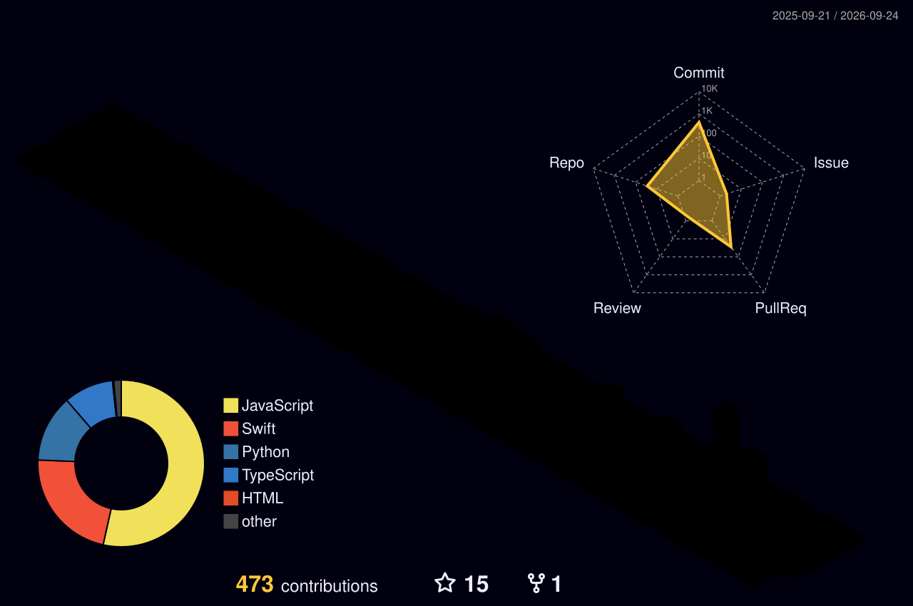

<!-- 现代化动态 Header Banner
<div align="center">
  
</div>

<!-- 动态社交图标 -->
<div align="center">
  
  [](https://github.com/shaun17)
  [](https://www.linkedin.com/)
  [](https://twitter.com/)
  
</div>

<!-- 现代化打字机效果 -->
<p align="center">
  <a href="https://git.io/typing-svg"></a>
</p>

<!-- 超现代的自我介绍 -->
<div align="center">
  <h4>👋 关于我</h4>
  <p>
    热衷于构建高可用、弹性强的分布式系统和云原生应用。<br>
    从微服务设计到容器编排，我不断探索现代后端技术与架构。<br>
    坚持简洁代码、可维护设计和持续改进的理念。
  </p>
</div>

<!-- 炫酷技术栈可视化 -->
<div align="center">
  <h3>🛠️ 我的技术武器库</h3>
  <br>

  
  <details>
    <summary><b>🔍 查看更多技能</b></summary>
    <div align="center">
      <h4>☁️ 云平台</h4>
      
<!--       <h4>🧰 DevOps & 工具</h4>
       -->
      <h4>🌐 Web 技术</h4>
      
    </div>
  </details>
</div>

<!-- 动态项目展示 - 现代卡片样式 -->
<div align="center">
  <h3>🚀 精品项目</h3>
  
  <a href="https://github.com/shaun17/Filter-Project">
    
  </a>
  <a href="https://github.com/shaun17/Spring-Dubbo">
    
  </a>
  <a href="https://github.com/shaun17/Nacos-Example">
    
  </a>
  <a href="https://github.com/shaun17/develop-tools">
    
  </a>

  <!-- 项目快捷导航 -->
  <div>
    
  </div>
</div>

<!-- 酷炫的 3D 贡献图 -->
<div align="center">
  <h3>📊 编码足迹</h3>
  
  <picture>
    <source media="(prefers-color-scheme: dark)" srcset="https://raw.githubusercontent.com/shaun17/shaun17/output/github-contribution-grid-snake-dark.svg" />
    <source media="(prefers-color-scheme: light)" srcset="https://raw.githubusercontent.com/shaun17/shaun17/output/github-contribution-grid-snake.svg" />
    
  </picture>
  
  <!-- 3D 贡献图 -->
  <a href="https://github.com/yoshi389111/github-profile-3d-contrib">
    
  </a>
  
</div>

<!-- 实时编码统计 - 酷炫风格 -->
<div align="center">
  <h3>⏱ 我的编码时间</h3>
  
  <!--START_SECTION:waka-->
**我是夜猫子 🦉** 

```text
🌞 早晨                     58 commits          ██░░░░░░░░░░░░░░░░░░░░░░░   09.51 % 
🌆 白天                     195 commits         ████████░░░░░░░░░░░░░░░░░   31.97 % 
🌃 傍晚                     282 commits         ████████████░░░░░░░░░░░░░   46.23 % 
🌙 晚上                     75 commits          ███░░░░░░░░░░░░░░░░░░░░░░   12.30 % 
```
📅 **我最有效率是在 星期一** 

```text
星期一                      128 commits         █████░░░░░░░░░░░░░░░░░░░░   20.98 % 
星期二                      111 commits         █████░░░░░░░░░░░░░░░░░░░░   18.20 % 
星期三                      91 commits          ████░░░░░░░░░░░░░░░░░░░░░   14.92 % 
星期四                      114 commits         █████░░░░░░░░░░░░░░░░░░░░   18.69 % 
星期五                      47 commits          ██░░░░░░░░░░░░░░░░░░░░░░░   07.70 % 
星期六                      50 commits          ██░░░░░░░░░░░░░░░░░░░░░░░   08.20 % 
星期日                      69 commits          ███░░░░░░░░░░░░░░░░░░░░░░   11.31 % 
```


📊 **本周消耗时间** 

```text
💬 编程语言: 
本周没有记录到任何活动
```


 Last Updated on 30/07/2025 02:23:10 UTC
<!--END_SECTION:waka--> 
 </div> <!-- 现代化统计卡片 --> <div align="center"> <h3>🔥 GitHub 数据</h3>    </div> <!-- 分布式系统架构动图 --> <div align="center"> <h3>🏗️ 分布式系统架构</h3>  </div> <!-- 现代化互动区域 --> <div align="center"> <h3>🤝 交流与合作</h3> <a href="https://github.com/shaun17/shaun17/discussions/new/choose">  </a> <a href="https://github.com/shaun17/shaun17/issues/new">  </a> <a href="mailto:your.email@example.com">  </a> </div> <!-- 创意访客计数器 --> <div align="center"> <h3>👀 访问计数</h3>  <h4>感谢您的访问! 👁️‍🗨️</h4> </div>
