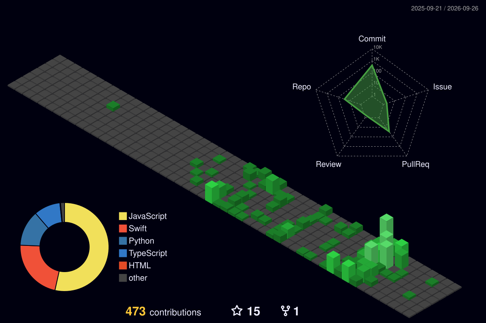

<!-- 终端像素风打字机效果 -->
<p align="center">
    
</p>

<!-- 终端风格分隔线 -->
<div align="left">
  <pre><code>$ cat userinfo.json</code></pre>
</div>

<!-- 像素风自我介绍 -->
<div align="left">
  <table>
    <tr>
      <td>
        <pre style="background-color: #0d1117; color: #00FF00; padding: 15px; border-radius: 8px; font-family: 'Courier New', monospace; text-align: left">
{
  "name": "wenren",
  "role": "Backend Developer/Client Engineer",
  "specialty": [
    "Distributed Systems",
    "Microservices Architecture",
    "High Performance APIs"
  ],
  "approach": "Building resilient, scalable systems that withstand chaos",
  "philosophy": "Simple solutions to complex problems",
  "current_quest": "Optimizing containerized applications at scale"
}
        </pre>
      </td>
    </tr>
  </table>
</div>

<!-- 终端风格分隔线 -->
<div align="left">
  <pre><code>$ list-skills --category tech</code></pre>
</div>

<!-- 终端风格技能展示 -->
<div align="left">
  <table >
    <tr>
      <td>
        <div style="background-color: #0d1117; padding: 10px; border-radius: 8px; text-align: left">
         <br>
        </div>
      </td>
    </tr>
  </table>
</div>


<div align="left">
  <pre><code>$ cat coding-language</code></pre>
</div>

<div align="left">
  
```text
Java                      █████████▓░░░░░░░░░  45.25%
Swift UI                  ██████▓░░░░░░░░░░░░  38.40%
Python                    ████▒░░░░░░░░░░░░░░  12.15%
Markdown                  █▓▒░░░░░░░░░░░░░░░░   6.13%
Node                      ▒░░░░░░░░░░░░░░░░░░   2.07%
```
</div>
<!-- 终端风格分隔线 -->
  
<div align="left">
  <pre><code>$ tail -n20 coding-time</code></pre>
</div>


<!-- 实时编码统计 - 酷炫风格 -->
  <!--START_SECTION:waka-->


**I'm an Early 🐤** 

```text
🌞 Morning                519 commits         ████░░░░░░░░░░░░░░░░░░░░░   14.67 % 
🌆 Daytime                1336 commits        █████████░░░░░░░░░░░░░░░░   37.75 % 
🌃 Evening                1550 commits        ███████████░░░░░░░░░░░░░░   43.80 % 
🌙 Night                  134 commits         █░░░░░░░░░░░░░░░░░░░░░░░░   03.79 % 
```
📅 **I'm Most Productive on Sunday** 

```text
Monday                   408 commits         ███░░░░░░░░░░░░░░░░░░░░░░   11.53 % 
Tuesday                  558 commits         ████░░░░░░░░░░░░░░░░░░░░░   15.77 % 
Wednesday                532 commits         ████░░░░░░░░░░░░░░░░░░░░░   15.03 % 
Thursday                 506 commits         ████░░░░░░░░░░░░░░░░░░░░░   14.30 % 
Friday                   438 commits         ███░░░░░░░░░░░░░░░░░░░░░░   12.38 % 
Saturday                 468 commits         ███░░░░░░░░░░░░░░░░░░░░░░   13.22 % 
Sunday                   629 commits         ████░░░░░░░░░░░░░░░░░░░░░   17.77 % 
```


📊 **This Week I Spent My Time On** 

```text
💬 Programming Languages: 
No Activity Tracked This Week
```


 Last Updated on 03/04/2026 03:08:03 UTC
<!--END_SECTION:waka--> 


<div align="left">
  <pre><code>$ cat coding-contribute </code></pre>
</div>
<!-- 酷炫的 3D 贡献图 -->
<div align="left">
  
  <!-- 3D 贡献图 -->
  <a href="https://github.com/yoshi389111/github-profile-3d-contrib">
    
  </a>
  
</div>

  <!-- 终端风格分隔线 --
  <div align="center"> <pre><code>$ display stats --theme pixel</code></pre> </div>
  <!-- 像素风格统计卡片 --
  <div>
<a href="https://git.io/streak-stats"></a>    
     
     
    </div> 
  
  <!-- 终端风格联系方式 --> 
  <div align="left"> <pre><code>$ contact --method preferred</code></pre> </div> 
  <!-- 像素风联系按钮 --> 
  <div align="left"> 
    <a href="https://github.com/shaun17">   </a> 
    <a href="mailto:wenmsg@gmail.com">  </a> 
    <a href="https://x.com/wenren_h">  </a> 
    
  </div> 
  
<div align="center"> 
       
</div> 
